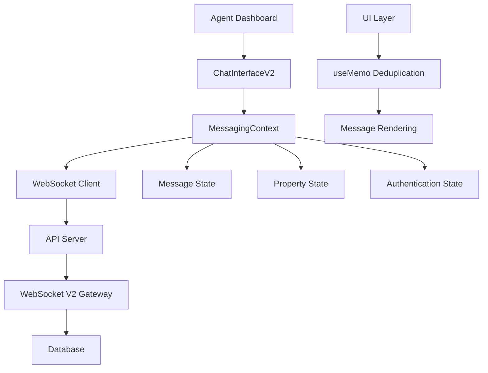
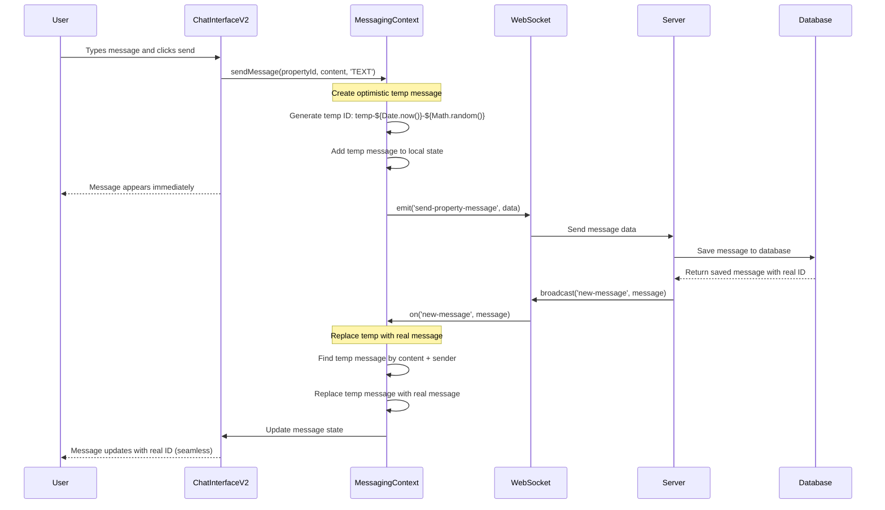
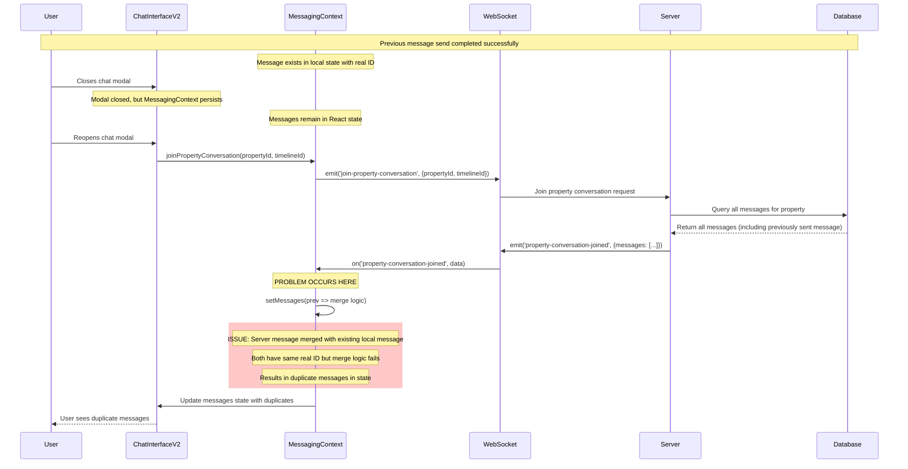
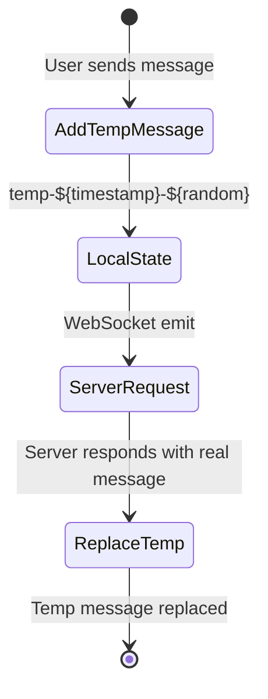
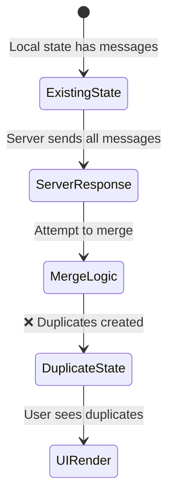

# Message Flow UML Diagram and Sequence Analysis

## System Architecture Overview



## Detailed Sequence Diagrams

### 1. Normal Message Send Flow (Working)



### 2. Chat Modal Reopen Flow (BROKEN - Causes Duplicates)



### 3. Property Conversation Join Handler - Detailed Flow

```mermaid
flowchart TD
    A[property-conversation-joined event received] --> B[Extract data.propertyId and data.messages]
    B --> C[Get existing messages from state: prev[propertyId]]
    C --> D[Deduplicate server messages among themselves]

    D --> E{Server messages deduplicated}
    E --> F[Create mergedMessages array starting with server messages]

    F --> G[Loop through existing local messages]
    G --> H{Is message temp?}

    H -->|Yes| I[Check if server has equivalent]
    H -->|No| J[❌ ISSUE: Non-temp message ignored]

    I --> K{Server has equivalent?}
    K -->|No| L[Add temp message to merged array]
    K -->|Yes| M[Skip temp message - server version preferred]

    J --> N[❌ DUPLICATE: Non-temp message already exists locally]

    L --> O[Update state with merged messages]
    M --> O
    N --> P[❌ RESULT: Duplicate messages in state]
    O --> Q[UI renders messages]

    style J fill:#ffcccc
    style N fill:#ffcccc
    style P fill:#ffcccc
```

## State Management Flow Analysis

### Message State Structure
```typescript
// MessagingContext state
const [messages, setMessages] = useState<Record<string, MessageV2[]>>({
  'property-123': [
    {
      id: 'msg-456',           // Real message ID from server
      content: 'Hello world',
      senderId: 'agent-789',
      senderType: 'AGENT',
      createdAt: '2025-01-01T10:00:00Z',
      propertyId: 'property-123'
    }
  ]
});
```

### Critical State Mutations

#### 1. sendMessage() - Optimistic Update


#### 2. property-conversation-joined - Bulk Load (PROBLEMATIC)


## Function Call Graph

### MessagingContext Key Functions

```mermaid
graph LR
    A[useEffect - Socket Init] --> B[connectWithAgentAuth]
    B --> C[setupSocketEventListeners]

    C --> D[on('new-message')]
    C --> E[on('property-conversation-joined')]
    C --> F[on('authenticated')]
    C --> G[on('connect')]

    H[sendMessage] --> I[Create temp message]
    I --> J[Add to state]
    J --> K[emit('send-property-message')]

    L[joinPropertyConversation] --> M[emit('join-property-conversation')]
    M --> E

    D --> N[Transform message]
    N --> O[Check duplicates]
    O --> P{Is duplicate?}
    P -->|No| Q[Add to state]
    P -->|Yes| R[Skip message]

    E --> S[Merge server messages]
    S --> T[❌ PROBLEMATIC MERGE]
    T --> U[Update state]
```

## Critical Issues Identified

### Issue 1: Incomplete Deduplication in property-conversation-joined

**Location**: MessagingContext.tsx:679-754

**Problem**:
```typescript
// ❌ CURRENT PROBLEMATIC CODE
const mergedMessages = [...deduplicatedServerMessages]; // Starts with ALL server messages

existingMessages.forEach(localMsg => {
  if (localMsg.id.startsWith('temp-')) {
    // Only handles temp messages
  }
  // ❌ MISSING: No handling for existing non-temp messages
});
```

**Result**: Server messages are added regardless of existing local non-temp messages.

### Issue 2: Time-Window Duplicate Detection

**Location**: MessagingContext.tsx:484-525

**Problem**:
```typescript
// ❌ 3-second window is too narrow
Math.abs(new Date(existingMsg.createdAt).getTime() - new Date(transformedMessage.createdAt).getTime()) < 3000
```

**Scenario**: User closes modal → waits 5 seconds → reopens modal → same message comes from server → not detected as duplicate.

### Issue 3: No State Cleanup on Modal Close

**Problem**: Messages persist in React state when modal is closed.

**Result**: When modal reopens, old messages are still in state, creating conflicts with incoming server messages.

## Recommended Fix Implementation

### Fix 1: Comprehensive Message Deduplication

```typescript
// Fixed property-conversation-joined handler
setMessages(prev => {
  const existingMessages = prev[data.propertyId] || [];
  const serverMessages = data.messages || [];

  // Create message map with ID as key for perfect deduplication
  const messageMap = new Map<string, MessageV2>();

  // Step 1: Add existing non-temp messages (preserve optimistic messages not yet confirmed)
  existingMessages.forEach(msg => {
    if (!msg.id.startsWith('temp-')) {
      messageMap.set(msg.id, msg);
    }
  });

  // Step 2: Add/update with server messages (server is authoritative)
  serverMessages.forEach(serverMsg => {
    const transformed = transformMessage(serverMsg);
    messageMap.set(transformed.id, transformed); // Overwrites any existing
  });

  // Step 3: Add back unconfirmed temp messages
  existingMessages.forEach(localMsg => {
    if (localMsg.id.startsWith('temp-')) {
      const hasServerEquivalent = serverMessages.some(serverMsg =>
        serverMsg.content.trim() === localMsg.content.trim() &&
        serverMsg.senderId === localMsg.senderId
      );
      if (!hasServerEquivalent) {
        messageMap.set(localMsg.id, localMsg);
      }
    }
  });

  return {
    ...prev,
    [data.propertyId]: Array.from(messageMap.values()).sort((a, b) =>
      new Date(a.createdAt).getTime() - new Date(b.createdAt).getTime()
    )
  };
});
```

### Fix 2: Remove Time Window from new-message Duplicate Detection

```typescript
// Simplified duplicate detection based on ID only
const isDuplicate = existingMessages.some(existingMsg =>
  existingMsg.id === transformedMessage.id
);
```

### Fix 3: Add Message Cleanup on Modal Close

```typescript
const leavePropertyConversation = useCallback((propertyId: string) => {
  if (!socket) return;

  socket.emit('leave-property-conversation', { propertyId });

  // Clear messages for this property to prevent duplicates on reopen
  setMessages(prev => {
    const next = { ...prev };
    delete next[propertyId];
    return next;
  });

  setActivePropertyId(null);
}, [socket]);
```

## Testing Scenarios

### Scenario A: Modal Reopen Test
1. Send message "Test message 1"
2. Verify message appears once
3. Close modal
4. Wait 10 seconds
5. Reopen modal
6. **Expected**: Message appears once
7. **Current**: Message appears twice

### Scenario B: Multiple Messages Test
1. Send messages "A", "B", "C"
2. Close modal
3. Reopen modal
4. **Expected**: A, B, C (once each)
5. **Current**: A, A, B, B, C, C

### Scenario C: Network Reconnection Test
1. Send message
2. Disconnect internet
3. Reconnect internet
4. **Expected**: Message appears once
5. **Current**: May appear multiple times

## Files Requiring Changes

1. **MessagingContext.tsx** (Primary)
   - Fix property-conversation-joined handler
   - Simplify duplicate detection
   - Add proper cleanup

2. **ChatInterfaceV2.tsx** (Secondary)
   - Keep current UI deduplication as safety net
   - Add proper cleanup on unmount

3. **Add Integration Tests**
   - Test modal reopen scenarios
   - Test network reconnection
   - Test concurrent users

This analysis provides a comprehensive understanding of the duplicate message issue and clear solutions for resolution.